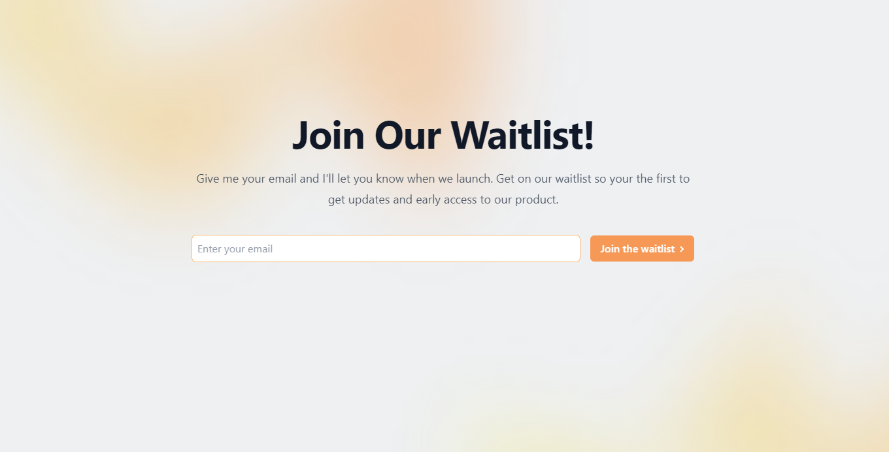

# Setup

## Create a New Supabase Project

Create a new supabase project and then run this in a new SQL query:

```
CREATE TABLE emails (
  id SERIAL PRIMARY KEY,
  email TEXT NOT NULL
);
```

## Replace Enviornment Variables

Replace `NEXT_PUBLIC_SUPABASE_URL`, and `NEXT_PUBLIC_SUPABASE_ANON_KEY` with their respected keys found in your [supabase API settings](https://app.supabase.com/project/:project-id/settings/api)

## Install dependencies and run the Next.js client

```
npm install
npm run dev
# or
yarn
yarn dev
```
